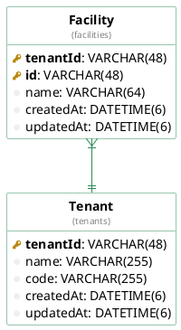

/* cSpell:disable */

## ER Diagram

```plantuml
@startuml

!define table(ename, dbname) entity "<b>ename</b>\n<font size=10 color=gray>(dbname)</font>"

!define pkey(x) {field} <b><color:DarkGoldenRod><&key></color> x</b>
!define fkey(x) {field} <color:#AAAAAA><&key></color> x
!define column(x) {field} <color:#EFEFEF><&media-record></color> x

hide stereotypes
hide methods
hide circle

top to bottom direction

skinparam roundcorner 5
skinparam linetype ortho
skinparam shadowing false
skinparam handwritten false

skinparam class {
    BackgroundColor white
    ArrowColor seagreen
    BorderColor seagreen
}


table( Tenant, tenants ) as tenants {
  pkey( tenantId ): VARCHAR(48) 
  column( name ): VARCHAR(255) 
  column( code ): VARCHAR(255) 
  column( createdAt ): DATETIME(6) 
  column( updatedAt ): DATETIME(6) 
}

table( Facility, facilities ) as facilities {
  pkey( tenantId ): VARCHAR(48) 
  pkey( id ): VARCHAR(48) 
  column( name ): VARCHAR(64) 
  column( createdAt ): DATETIME(6) 
  column( updatedAt ): DATETIME(6) 
}

facilities }|--|| tenants

@enduml

```
